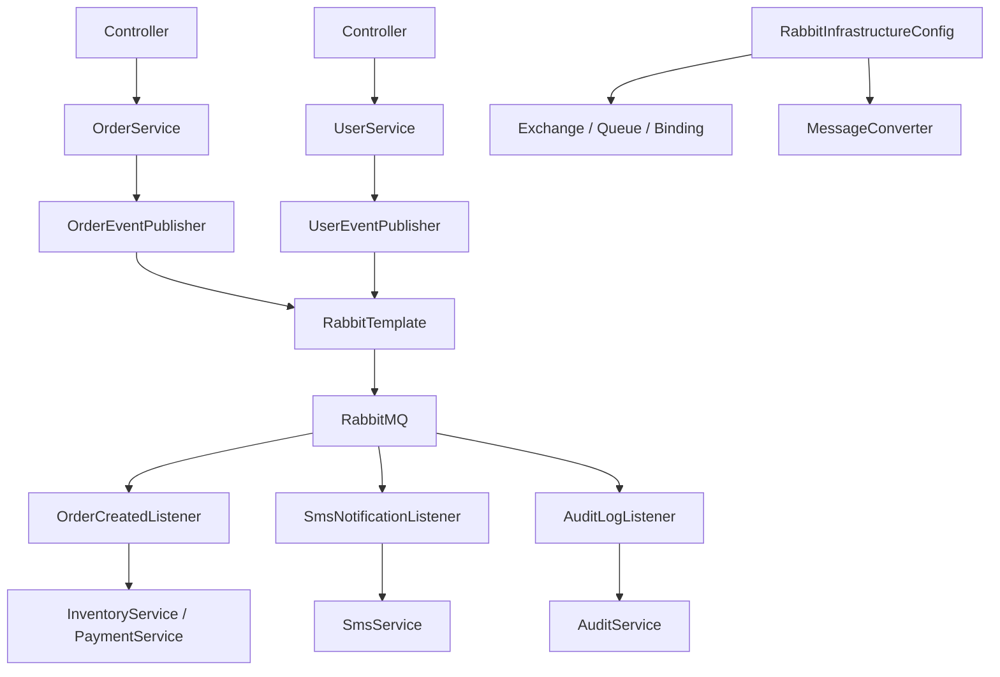

> 上级：[[后端学习 from zero]]

## RabbitMQ 基本概念

- Connection：客户端与 RabbitMQ 之间的连接。
- Channel：连接内部的消息通道，负责实际通信。
- Broker：消息队列服务器实体。
- Virtual Host：虚拟主机，包含交换机、队列等对象。
- Exchange：交换机，接收生产者消息，并按规则路由到队列。
- Queue：队列，消息的载体。
- Binding：交换机和队列之间的虚拟连接。

基本流程：

```text
生产者 -> Exchange -> Queue -> 消费者
```

RabbitMQ 消息代理流程：

1. 生产者与 Broker 建立连接，向指定 Virtual Host 发送消息。
2. Virtual Host 内部的 Exchange 接收消息，并将消息传递到绑定的 Queue。
3. 消费者连接 Broker，通过 Channel 消费队列中的消息。

管理页面可以按这个顺序排查：先看 `Connections` 确认程序连上 MQ，再看 `Exchanges` 确认交换机和绑定，最后看 `Queues and Streams` 确认消息是否进入队列、是否消费和是否积压。

Exchange 是消息分发器。生产者通常不直接把消息发给 Queue，而是先发给 Exchange，再由 Exchange 按 routing key 或交换机类型路由到一个或多个 Queue。

## 管理页面怎么看

可以按这个顺序理解：

1. Connections：确认程序连上了 MQ。
2. Exchanges：确认交换机建好了。
3. Queues and Streams：确认消息进队列、被消费。

Exchange 的核心职责是：决定一条消息应该进哪些队列。

## RabbitMQ 工作模式

### 简单模式

生产者通过 MQ 将消息放入队列，队列发送给消费者。实际工作中较少直接使用。

### 工作队列

类似负载均衡。多个消费者消费同一个队列里的消息，每个消费者收到不同消息。

适合异步处理，可以通过增加消费者实例水平扩容。

### 发布订阅

有交换机参与。生产者把消息发到交换机，交换机把消息广播给绑定的多个队列。

适合一份数据分发给多个订阅者。

### 路由模式

发布订阅的变种。Exchange 根据 routing key 有条件地把消息发给不同队列。

典型场景是日志：`error` 级别日志进入监控队列。

### 主题模式

路由模式升级版，routing key 支持通配符。

- `*` 匹配单个词。
- `#` 匹配多个词。

能用路由就不用主题，除非确实需要模糊匹配。

### RPC 同步通信

MQ 通常用于异步，但 RPC 模式需要生产者等待消费者反馈。实际用得较少。

## 代码组织

一个更清晰的组织方式：



- Controller 只接请求。
- Service 只做业务。
- Publisher 专门负责发消息。
- Listener 专门负责收消息。
- Config 统一管理交换机、队列、绑定、转换器。

`RabbitTemplate` 用来发消息，`RabbitListener` 用来注解监听消息。

## 可靠性与消费语义

消息队列解决的是服务之间的时间耦合，不会自动解决数据一致性。消费者处理失败时不要直接 ack，否则消息会丢失；可以重试，超过次数后进入死信队列。

- 网络重试会导致重复投递，消费者必须按业务事件 ID 幂等，不能假设消息只来一次。
- 多个消费者并行时不应依赖全局顺序；需要顺序的业务应按同一聚合键分区，或用数据库状态条件控制迁移。
- 队列堆积需要监控，消费者处理不过来时可以扩容，但也要设置有界容量、限流和降级。

典型异步链路：

```text
请求
-> 本地事务写业务数据和 outbox 事件
-> Publisher 投递 MQ
-> Consumer 按 eventId 幂等处理
-> 成功 ack
-> 失败重试，超过阈值进入死信
```

能用精确路由解决的问题，不必为了模糊匹配引入主题模式；能用同步调用清晰完成的流程，也不必为了“高并发”强行改成 MQ。
