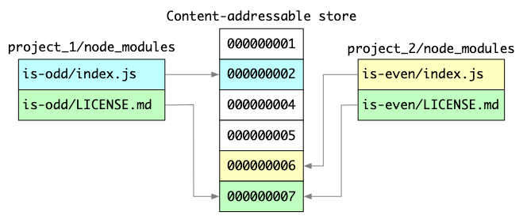
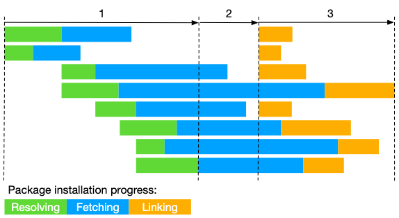
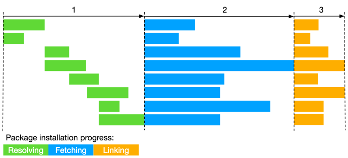
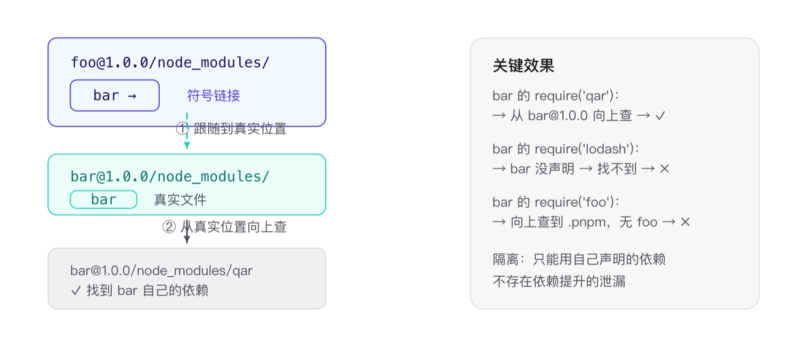
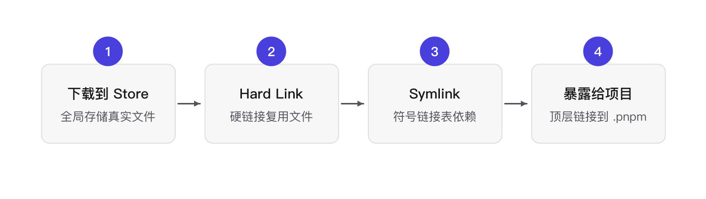
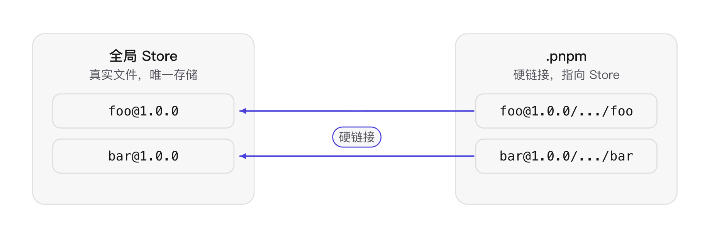
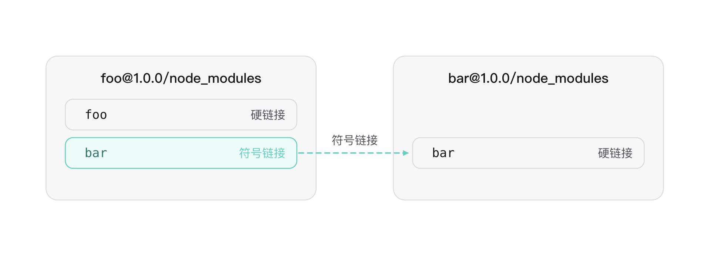
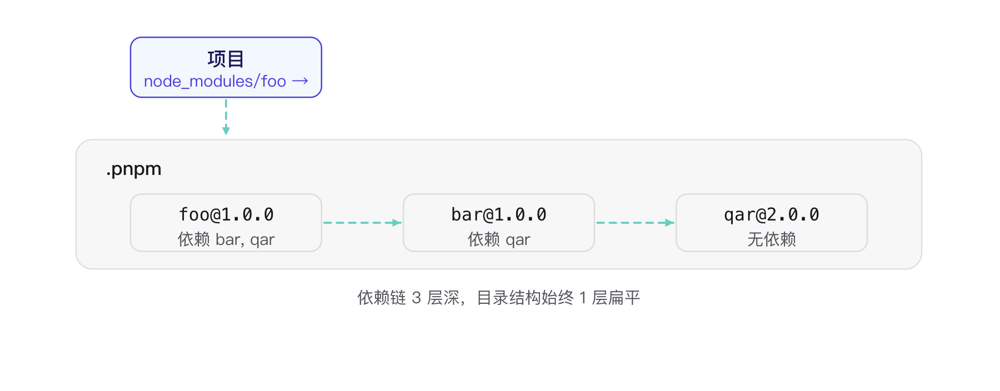
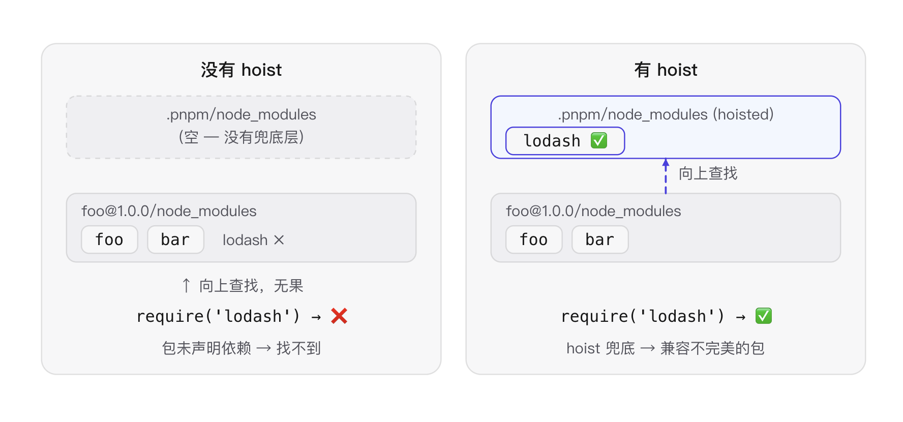

## pnpm 初衷

1. **节省磁盘空间**
使用 npm 时，依赖每次被不同的项目使用，都会重复安装一次。  而在使用 pnpm 时，依赖会被存储在内容可寻址的存储中，所以：
1. 如果你用到了某依赖项的不同版本，只会将不同版本间有差异的文件添加到仓库
1. 所有文件都会存储在硬盘上的某一位置。 当软件包被被安装时，包里的文件会硬链接到这一位置，而不会占用额外的磁盘空间。 这允许你跨项目地共享同一版本的依赖。

pnpm 的存储核心是：

- 包先进入全局 store
- 项目里的 node_modules 不直接复制一份完整内容
- 而是通过 hard link / symlink 把 store 里的内容组织出来

1. **提高安装速度**
  
  
pnpm 分三个阶段执行安装：
1. 依赖解析。 仓库中没有的依赖都被识别并获取到仓库。
1. 目录结构计算。 `node_modules` 目录结构是根据依赖计算出来的。
1. 链接依赖项。 所有以前安装过的依赖项都会直接从存储区中获取并链接到 `node_modules`。
链接优化：
对于模块的使用，通过链接而不是复制，这种方法比传统的三阶段安装过程（解析、获取和写入所有依赖项到 `node_modules`）要快得多。
流水线优化：

- 对每个包来说，还是 Resolving -\> Fetching -\> Linking 这三步
- 但**不同包之间不用等所有包都完成第 1 步，才开始第 2 步**

1. **非扁平的 node_modules 目录**
使用 npm 或 Yarn Classic 安装依赖项时，所有的包都尽量被提升到node module的根目录，依赖会扁平化的在node module 中平铺。
这会带来的问题是：
1. 依赖包作为普通文件，可能被修改，那包语义会被破坏，工具无法正常分析，行为和官方可能不一致，不利于合作
1. 如果依赖可以被任意篡改，构建工具，安全扫描，缓存系统，增量编译，都难以准确判断项目状态。
1. 项目状态无法从 `package.json` 和 lockfile 完整恢复。
  例如：为了修一个 bug，直接改了：`node_modules/lodash/index.js`，本地运行正常。但同事执行 `npm install` 后，你的修改消失了。你的机器：正常，同事机器：有 bug，CI：有 bug
1. 可能造成幽灵依赖，`"dependencies": {}` ，数组里没有声明，但是却可以 `import` ，这些依赖通常是一些包的子依赖，依赖和声明的不一致会导致问题：也就是没有声明的依赖都是不可靠的，因为依赖是依靠工具和他人维护的包进行引入自动化管理的，只有声明的依赖被工具保证存在，例如：
1. 一个依赖的版本升级，子依赖不被保证继续存在
1. 换个包管理器后，安装布局变了，lodash 不再能被解析。
为什么 pnpm 要进行严格的访问控制：&lt;br&gt;[pnpm’s strictness helps to avoid silly bugs](https://medium.com/pnpm/pnpms-strictness-helps-to-avoid-silly-bugs-9a15fb306308)
pnpm 使用 **符号链接**将项目的直接依赖项添加到模块目录的根目录中。由于项目里没有实际的依赖文件，所以依赖不会被修改

## **Node 默认解析规则（CommonJS）**

当 `require('lodash')` 执行时（非相对路径、非核心模块），Node 按以下顺序查找：

1. 从**当前文件所在目录**的 `node_modules/` 找 `lodash`
2. 没找到 → 进入**父目录**的 `node_modules/` 找
3. 没找到 → 继续向上，直到**文件系统根目录**的 `node_modules/`
4. 全程没找到 → 抛 `MODULE_NOT_FOUND`

Node 默认 `preserveSymlinks: false`，意思是：**遇到符号链接时，先跟随到真实物理位置，再从那个位置开始向上查找**。
**Node 不会递归搜索 node_modules 的子目录，它只在每一层找 ****`node_modules/<包名>`**** 这个直接子节点**。

## **Symlink**与依赖解析

pnpm 的 `node_modules` 布局使用符号链接来创建依赖项的嵌套结构。
`node_modules` 内每个包的每个文件都是到内容可寻址存储的硬链接。
假设你安装了依赖于 `bar@1.0.0` 的 `foo@1.0.0`。
pnpm 会将两个包硬链接到 node_modules 如下所示：

```javascript
node_modules
└── .pnpm
    ├── bar@1.0.0
    │   └── node_modules
    │       └── bar
    │           ├── index.js     -> <store>/001
    │           └── package.json -> <store>/002
    └── foo@1.0.0
        └── node_modules
            └── foo
                ├── index.js     -> <store>/003
                └── package.json -> <store>/004
```

这些是 `node_modules` 中唯一的“真实”文件。store 是本机的全局存储文件
解析会把所有包都硬链接到 `node_modules`，然后创建符号链接来构建嵌套的依赖关系图结构。
为什么 pnpm 要把包放在`.pnpm/foo@1.0.0/node_modules/foo`，而不是直接放在`.pnpm/foo@1.0.0`

1. 自依赖的逻辑：默认认为自己在`node_modules/foo` 下，如果直接写成`.pnpm/foo@1.0.0/...` ,自依赖的解析会失效，这里的前提是依赖作为包，会把自己当做一个项目的包去执行逻辑
2. **避免循环符号链接。** 依赖以及需要依赖的包被放置在一个文件夹下。 对于 Node.js 来说，依赖在包的内部 `node_modules` 中或在父目录中的任何其它 `node_modules` 中是没有区别的。

```javascript
pnpm:
.pnpm/
├── foo@1.0.0/
│   └── node_modules/
│       └── foo
│
└── bar@1.0.0/
    └── node_modules/
        └── bar

循环链接:
foo/
└── node_modules/
    └── bar
      └──foo/...
```

如果按直觉构造依赖树，会产生大量互相指向的符号链接，结构复杂、难维护，而且在某些工具里确实可能出现循环遍历问题。这其实就是扁平化的意图
pnpm 构建 node module 的过程 分为几个步骤：


- **下载依赖到全局 Store，**pnpm 把所有依赖包下载到一个**全局 Store**（内容寻址存储）。无论多少个项目引用同一个包，磁盘上只存一份真实文件。这是后续一切复用的基础。
- **Hard Link（硬链接）**
  - 用于复用真实文件，不处理依赖关系，只是递归的把依赖文件进行复用
  - `.pnpm → store`

 ```text

node_modules
└── .pnpm
    ├── foo@1.0.0
    │   └── node_modules
    │       └── foo
    └── bar@1.0.0
        └── node_modules
            └── bar
 ```

 

- **Symlink（符号链接）**
  - 用于表达依赖关系，硬链接只是单纯的把依赖给装到电脑上，项目可以访问，一些依赖内部的依赖关系，比如子依赖，就通过符号链接表达
  - `foo → bar`

 ```text

.pnpm
├── foo@1.0.0
│   └── node_modules
│       ├── foo
│       └── bar -> ../../bar@1.0.0/node_modules/bar
└── bar@1.0.0
    └── node_modules
        └── bar
 ```

 

- **暴露给项目**
  - `项目 → foo`
  - 再创建一层链接：

 ```text

node_modules
├── foo -> .pnpm/foo@1.0.0/node_modules/foo
└── .pnp
 ```

项目本身只需要直接依赖（比如 foo），不需要知道 foo 的依赖链。所以 pnpm 在项目顶层 `node_modules/` 里再创建一层符号链接：`node_modules/foo → .pnpm/foo@1.0.0/node_modules/foo`。
现在加入 `qar@2.0.0` 作为 foo 和 bar 的依赖。虽然依赖链变成了 **foo → bar → qar**（3 层深），但 `.pnpm` 里所有包始终在**同一层级**——foo@1.0.0、bar@1.0.0、qar@2.0.0 都是 `.pnpm` 的直接子目录，目录深度不随依赖深度增长。
让我们添加 `qar@2.0.0` 作为 `bar` 和 `foo` 的依赖项。 这是最终的结构的样子：

```text
node_modules
├── foo -> ./.pnpm/foo@1.0.0/node_modules/foo
└── .pnpm
    ├── bar@1.0.0
    │   └── node_modules
    │       ├── bar -> <store>
    │       └── qar -> ../../qar@2.0.0/node_modules/qar
    ├── foo@1.0.0
    │   └── node_modules
    │       ├── foo -> <store>
    │       ├── bar -> ../../bar@1.0.0/node_modules/bar
    │       └── qar -> ../../qar@2.0.0/node_modules/qar
    └── qar@2.0.0
        └── node_modules
            └── qar -> <store>
```

如你所见，即使图形现在更深（`foo > bar > qar`），但目录深度仍然相同。（追求扁平目录是为了防止嵌套带来的重复下载是项目级的，软硬链接的复用是机器级的，还能带来依赖隔离）

它与 Node 的模块解析算法完全兼容，解析模块时，Node 会忽略符号链接，并解析到包的实际位置，因此，`bar` 也可以解析其在 `bar@1.0.0/node_modules` 中的依赖项。
关键在于 **Node 的模块解析算法会跟随符号链接到包的实际物理位置**。
当 foo 的代码 `require('bar')` 时，Node 发现 `bar` 是个符号链接，跟随它到达 `bar@1.0.0/node_modules/bar`，然后**从这个真实位置开始向上查找依赖**。
这意味着 bar 永远只能访问到自己 `node_modules` 里声明的依赖（比如 qar），不会意外引用到 foo 的依赖。**`无法直接 import`**，这就是 pnpm 的「严格依赖」隔离：**你声明的依赖才能用，没声明的碰不到**，从根本上杜绝了 npm/yarn 那种依赖提升导致的幽灵依赖问题。

## hoist

但是由于历史上有太多 npm 生态下的幽灵依赖（依赖没被声明，所以 pnpm 无法解析，导致依赖缺失），在 pnpm 生态下会直接报错，所以 pnpm 做了一个折中方案。

pnpm 默认开启 `hoist-pattern: ['*']`，把所有依赖**额外提升**到 `.pnpm/node_modules/` 里（图中右半紫色框）。这不是替代步骤 2-3 的符号链接，而是在它们之上加了一层**共享兜底**。
关键在于 Node 的模块解析算法是**逐级向上**的：当 foo 的代码 `require('lodash')` 时——

1. 先查 `foo@1.0.0/node_modules/lodash` → 没有（因为 foo 没声明）
2. **向上**查 `.pnpm/node_modules/lodash` → 找到！（hoist 放在这了）
`.pnpm/node_modules` 恰好是 `foo@1.0.0/` 的父级目录，所以 Node 的向上解析天然能到达这里。
使用平铺的 `node_modules` 结构，所有被提升的包都可以访问。 默认会额外创建：

```text
node_modules
└── .pnpm
    └── node_modules
```

里面放大量提升（hoisted）的依赖：

```text
node_modules
└── .pnpm
    └── node_modules
        ├── lodash
        ├── react
        ├── tslib
        └── ...
```

要禁用此提升，请将 hoist 设置为 false。
有 peer 依赖的包的结构[更加复杂](https://pnpm.io/zh/how-peers-are-resolved)一些，但思路是一样的：使用软链与平铺目录来构建一个嵌套结构。

## peerDependencies

peerDependencies 对等依赖是一种“宿主必须提供”的依赖声明。

- 这个包运行时需要它
- 但这份依赖不应该由这个包自己偷偷装一份
- 应该由使用它的上层应用来安装
比如一个 React 组件库：

```javascript
{
  "peerDependencies": {
    "react": "^19.0.0",
    "react-dom": "^19.0.0"
  }
}
```

意思是：

- 这个组件库依赖 React
- 但真正安装 React 的应该是宿主项目
- 宿主如果没装，或者版本不匹配，就应该报警
react 本身不应该绑定 DOM，如果 react 直接依赖 react-dom，那就等于默认把 DOM 平台绑死了。React Native 也会被迫带上 DOM 渲染器，服务端、测试环境也会多一层没必要的依赖，而使用 React DOM 又必须有 React 的依赖，peerDepenency就是这种依赖
`peerDependencies` 的作用是，**让多个包共享同一个宿主依赖。**
假设你在写一个 React 组件库：`my-ui` ，内部：`import { useState } from "react";`
可能出现：

```text
app
├── react
└── my-ui
    └── react
```

两个 React 实例。这会导致错误：Invalid hook call，因为：`app 的 useState ≠ my-ui 的 useState`
所以组件库应该写：

```text
{
  "peerDependencies": {
    "react":"^19"
  }
}
```

意思变成：我需要 React，但不要给我装 React。请使用我的人提供 React。就实现里**让多个包共享同一个宿主依赖。这样保证了相同的库版本号完全一致**
React Native 和 React web 的版本号不同是没事

## pnpm workspace

pnpm 内置了对 monorepo 的支持，你可以创建一个工作空间以将多个项目合并到一个仓库中。一个工作空间必须在它的根目录有一个 [`pnpm-workspace.yaml`](https://pnpm.io/zh/pnpm-workspace_yaml) 文件。
pnpm workspace 解决的不是“怎么构建项目”，而是一个更底层的问题：
**一个仓库里有多个项目的 package，它们如何被同一个包管理器安装、解析、互相引用。**
只要一个目录里有 package.json，它本质上就是一个 package。
一个仓库里可能有以下的内容：

```java
根目录 package.json
apps/mobile/package.json
packages/tuanchat-domain/package.json
packages/tuanchat-query/package.json
```

没有 workspace 时，包管理器通常只关心“当前目录这个 package”。有 workspace 后，pnpm 会把仓库里的 package.json 都纳入管理。
pnpm-workspace.yaml 定义这个包的边界

```javascript
packages:
  - "apps/*"
  - "packages/*"
```

所以 pnpm 会把这些 package 注册成一个整体：

```javascript
tuan-chat-web
@tuanchat/mobile
@tuanchat/domain
@tuanchat/query
@tuanchat/local-db
@tuanchat/openapi-client
...
```

注意：**根目录 package 默认也属于 workspace**，即使它没有写进 pnpm-workspace.yaml。
对于外部依赖，比如 react，它会链接到 pnpm store。
对于 workspace 内部依赖，比如 @tuanchat/domain，它会链接到仓库里的真实目录：
`apps/mobile/node_modules/@tuanchat/domain -> packages/tuanchat-domain`
所以你改 packages/tuanchat-domain/src/...，mobile 和 web 引用到的就是最新源码，
不需要发布、不需要重新安装本地 npm 包。迭代的方便性，是相比传统分发方式最直观的优点
**那 workspace 到底提供了什么能力？**
第一，统一安装。会安装整个 workspace 的所有依赖，并生成一个统一的 pnpm-lock.yaml。
第二，本地包互相引用。表示这个依赖来自本仓库，不来自 npm。
第三，按 package 运行命令。意思是：找到 workspace 里名为 @tuanchat/mobile 的 package，然后执行它自己的：`scripts { ... }`
**它不负责什么？**
pnpm workspace 不负责：

```javascript
任务缓存
增量构建
依赖图调度 build/test/lint
远程缓存
CI 智能跳过
```

它知道“package 之间怎么依赖”，但它不会自动决定：
`改了 @tuanchat/domain，只跑受影响的 web/mobile 测试`
这就是 Turbo、Nx 这类工具补上的层。

```javascript
pnpm workspace
  解决：包在哪里，依赖怎么装，本地包怎么链接

Turbo
  解决：哪些任务要跑，怎么并行，怎么缓存，怎么跳过
```
