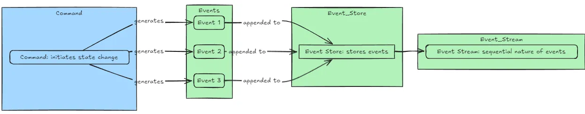

## 事件溯源

[事件溯源模式 - Azure Architecture Center](https://learn.microsoft.com/zh-cn/azure/architecture/patterns/event-sourcing)
如何把复杂的状态修改良好的编排呢？思考这个问题的过程中其实不断的贴近了事件溯源的实现

### 事件

用事件中心，对事件进行定义，并封装状态，使得调用者无需关心底层的实现，将复杂状态操作良好的编排在了一起

解耦不是万能良药，并非无脑的可以用 hooks 封装各种 UI逻辑然后组装到一个编排者里，如果几个状态相互关联，那么 hooks 将发生大量的相互调用，传递，反而把状态的复杂给隐式化了，对于可维护性而言反而更差

### 溯源

因为事件是不可变、只追加的历史记录，所以任何时刻都能回溯——这就是"溯源"的字面来源
"溯源"的物理基础：一个**只追加（append-only）的日志**。`append` 永远不修改、不删除，只往末尾加；`get_all_events` 返回完整历史。只要这个日志在，历史就丢不了。
**单个事件不可变 + 存储只追加 ⇒ 整个历史日志不可篡改**。"回溯"的本质是：**给我一个时间点 T，我能还原出 T 时刻的状态**。
**只追加 ⇒ 不会被删/改**，所以"截止到 T 的那段历史"永远原封不动地躺在日志前半部分。
比如一个编辑器的编辑行为：在 UI 上看到的是"旧文本被新文本替换了"。但编辑器内部记录的**从来不是覆写**，而是一串原子操作。举个最朴素的方案：

```text
操作类型只有三种（OT/CRDT 的基础）：
  INSERT(pos, text)   在位置 pos 插入 text
  DELETE(pos, length) 从位置 pos 删除 length 个字符
  RETAIN(length)      跳过 length 个字符（保持不变）
```

**没有任何"覆写"操作**。"覆写"只是用户视角的抽象，底下被拆成了 DELETE + INSERT 两个原子事件。而"状态"只是对这个副本做一次 reduce 运算的结果：

```javascript
当前状态 = reduce(apply, [], 所有事件)
T 时刻状态 = reduce(apply, [], 截止到 T 的事件)
某个维度视图 = reduce(apply', [], 筛选后的事件)
```

读操作（`get_items`）才是"溯源"真正发生的地方——把整个事件流重放一遍，从头遍历全部历史

### 重放

重放优化是事件溯源落地时最大的工程问题——日志越涨越长，每次查询都从头算一遍扛不住。优化手段从朴素到激进大致有六类，按"侵入性递增"排列。

- 优化 1：内存缓存（最朴素），
  - 原理：重放结果缓存起来，新事件到来才清掉重算。查询走缓存，O(1)。
  - 优点是实现极简，0 改动
  - 缺点：
  1. 进程重启缓存丢，冷启动要全量重放
  2. 缓存粒度粗（整个视图），一个事件让整张表失效
  3. 多实例不共享（每个进程各自缓存）
  - **适用**：小规模、读远大于写、视图少
- 优化 2：快照（Snapshot）
  - 思想：**每隔 N 个事件存一个状态快照，重放时从最近的快照开始，只重放后续事件**。
  - **效果**：从 O(N) 降到 O(N mod snapshot_interval)。100 万事件 + 1000 一快照，重放从 100 万次降到最多 999 次。
  - **关键性质**：
    - 快照是**优化手段**，不是真相源——丢了能从空状态重放重建
    - 事件日志一条没删，审计完整
    - 快照本身也可以是 append-only 的（每次存新快照，不覆盖旧快照）
  - **缺点**：
    - 快照状态可能很大（大聚合根）
    - 反序列化快照有成本
    - 快照版本和事件版本要对应
  - **适用**：所有正经事件溯源系统的标配
- 优化 3：投影 / 读模型（Projections）—— CQRS 标配
  - 把"重放算状态"改成"预先重放好，存成查询友好的格式"。

  ```text
  事件日志（不可变、只追加）
      │
      │ 实时投影
      ▼
  读模型（预计算好的查询表）
      ├── 物品数量表 {sword: 2, bow: 1, ...}
      ├── 按来源统计表 {sword: {castle, dungeon}, ...}
      └── 按时间索引 [...]
  ```

  - 查询时直接读读模型，O(1)，不用重放。
  - 投影本质是**把重放从"查询时"提前到"写入时"**：每个事件 arrive 时增量更新读模型，查询走预计算结果。
  - **优点**：
    - 查询 O(1)
    - 读模型可以是任意结构（关系表、倒排索引、搜索引警、图数据库）
    - 不同查询用不同读模型，互不干扰
  - **缺点**：
    - 写入路径变复杂（要同时写事件 + 更新读模型）
    - 读模型和事件日志之间需要一致性保证（最终一致）
    - 读模型可以丢，从事件日志重投一遍即可重建
  - **适用**：查询多、查询模式多样、读远大于写
- 优化 4：增量投影 + 版本号
  - 朴素投影每次都从头扫日志重建读模型。增量投影记录"我处理到哪个事件了"，只处理新事件：
  - 配合检查点：每处理 N 个事件存一次 `last_processed_version` 到磁盘，重启后从检查点继续。**效果**：投影重建从 O(N) 降到 O(增量)，重启不重算。
- 优化 5：分区重放 / 分片
  - 单流重放是瓶颈，把事件流按聚合根 ID 分片：

  ```text
  事件流按 item_name 分片:
    shard_sword:    [所有 sword 相关事件]
    shard_bow:      [所有 bow 相关事件]
    shard_torch:    [所有 torch 相关事件]
  ```

  - 查询"sword 多少把"，只重放 sword 分片，不用扫全量日志。多分片可以并行重放。**适用**：大规模、单聚合根状态不大的场景
- 优化 6：压缩（Log Compaction）
  - 借鉴 Kafka 的 log compaction 思路：**对于同一个 key，只保留最新的状态事件，删掉中间的历史事件**。

  ```text
  压缩前: [ADD sword@10:00, ADD sword@10:05, REMOVE sword@10:10]
  压缩后: [REMOVE sword@10:10]      ← 只留每个 key 最后一条
  ```

  - 简单而言就是把过时的事件删去，也不需要审计这部分的过去
  - **适用**：纯物化视图、不需要完整审计的场景
工程实践：组合使用，真实系统可以是多种优化的组合：

```text
                    事件日志（不可变、只追加）
                    │
            ┌───────┼───────┐
            ▼       ▼       ▼
           快照    增量投影  分片
            │       │       │
            ▼       ▼       ▼
          聚合根   读模型   并行重放
            │       │       │
            └───┬───┘       │
                ▼           │
             内存缓存        │
                │           │
                ▼           ▼
            应用查询    运维/调试重放
```

## 撤销？

撤销和重放是不一致的，如果只是读取上一个状态，可以重放，而回到上一个状态再继续修改，产生的新事件，中间会隔着未播放的事件，导致重放到最新的状态时出错

### 逆事件 append

是否可以删除重放后的事件呢？这就违背了事件溯源 append only的约束了，无法追溯所有状态，而这时就需要逆运算了，通过一个事件抵消上一个事件的效果
在传统软件里，只要操作是可逆的，或者可以被转换为可逆的操作，那么操作就可以撤回：
**追加一个反向事件（补偿事件），核心思想**：不删旧事件，追加一条"反向事件"把效果抵消掉
**关键性质**：

 1. **历史完整**——误操作那条事件还在那，"曾经误加"这个事实被记录下来。
 2. **状态正确**——重放后当前状态等于"没加过"。
 3. **可追溯**——你能回答"什么时候误加了、什么时候纠正的"。
这就是事件溯源处理"撤销"的标准姿势，专业术语叫 **Compensating Event（补偿事件）** 或 **Reversal Event（反向事件）**。
**简单的逆事件确实处理不了连续撤回，必须给事件加一个"因果引用"结构**。
这就是你说的"连续撤回没法处理"的根源：**逆事件缺少因果指针**。不是无脑的逆运算最新的事件，而是维护一个指针，指向我们目标的逆运算事件，连续撤回的本质要求是**按身份撤销**

### 墓碑机制

**但是上述方案是存在很多缺陷，事件没有自然逆运算，或者我们不能删事件**，**分布式乱序到达时中间状态可能错误，幂等风险等等**
可以把被抵消的事件**标记为 tombstone（墓碑）**，然后重放时跳过，即可正确还原新的状态，这样就既保留了 append only，也可以正确读取状态，中间状态也是理论可还原的，只要重放到这个事件前一刻，然后执行这个墓碑事件就行了，那么就不会违背事件溯源的约束

```javascript
def replay(events):
    # 第一步：收集所有被抵消的事件 ID
    reversed_ids = {e.reverse_of for e in events if e.reverse_of is not None}
    # 第二步：重放时跳过被抵消的
    state = 0
    for e in events:
        if e.id in reversed_ids:
            continue                    # ← 跳过已被抵消的
        if e.type == ITEM_ADDED:
            state += 1
        elif e.type == ITEM_REMOVED:
            state -= 1
    return state
```

墓碑本身只是个"标记撤销"的事件，只能通过重放看到 Undo 的效果，那 Redo 要"撤销这个撤销"怎么办？
核心想法就是定义一个撤回的逆事件，**Untombstone（墓碑的墓碑）**
首先，Undo 本身也是一个事件，会给指向的事件加上墓碑，这么做的原因是要让撤回这个行为可追溯，是在什么时刻被撤回的，那么同理你 Redo 也应该是一个独立的事件，把这个动作记录下来作为一个 untombstone 的操作
否则直接修改字段，或者删除事件，都会对过去进行破坏

### 优化：操作栈

操作栈是编辑器里 Ctrl+Z/Y 的标准实现，本质上就是**事件溯源 + 因果引用**的一个特化版本——它把"哪些事件还能撤销"这个状态显式地维护成两个栈。

```javascript
undo_stack:  存"已执行但还能撤销"的操作
redo_stack:  存"已撤销但还能重做"的操作
event_log:   不可变、只追加的完整事件日志（真正的历史）
```

**三个操作的流程**
**1. 执行新操作（do）**

```text
用户执行 op_X
  → 追加 event {id, type:DO, data, prev=None} 到 event_log
  → push op_X 到 undo_stack
  → 清空 redo_stack       ← 一旦有新操作，重做历史作废
```

清空 redo_stack 是为了遵守"重做只能紧接着撤销做"的常识——你撤销了几步，然后输入了新内容，那些被撤销的操作就再也回不来了（重做栈清空）。
**2. 撤销（undo）**

```text
用户按 Ctrl+Z
  → 从 undo_stack 弹出栈顶 op_X
  → 追加 event {id, type:UNDO, reverse_of: op_X.id} 到 event_log
  → push op_X 到 redo_stack
  → 把 op_X 的效果从当前状态抹掉（通过 apply 逆事件）
```

**关键点**：撤销不是删 op_X，而是追加一条 `UNDO` 事件引用 op_X 的 id。
**3. 重做（redo）**

```text
用户按 Ctrl+Y
  → 从 redo_stack 弹出栈顶 op_X
  → 追加 event {id, type:REDO, reverse_of: <对应UNDO事件的id>} 到 event_log
  → push op_X 回 undo_stack
  → 把 op_X 的效果重新应用
```

重做也是追加事件，不是"恢复原事件"。

- 底层用因果引用 + 逆事件（保证审计和协作能力）
- 上层为单机客户端额外维护 undo_stack/redo_stack（加速撤销）
- 两者叠加：既有 O(1) 撤销，又有完整审计——很多真实编辑器就是这么做的
